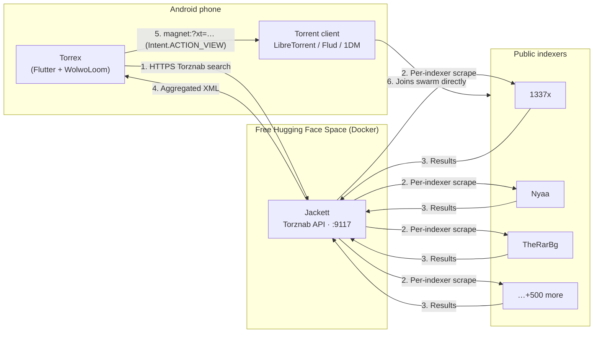
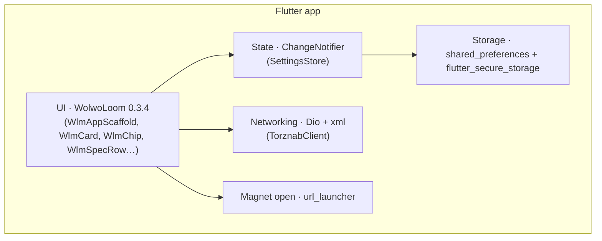
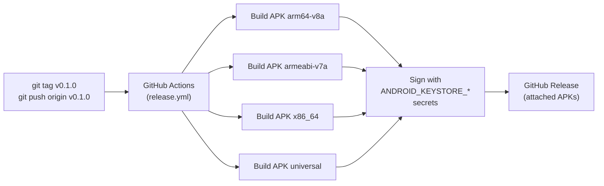
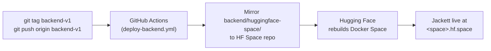

# Torrex

A Flutter torrent-search client built on the
[WolwoLoom](https://github.com/iyashwantsaini/WolwoLoom) design system.
Talks to any **Torznab**-compatible backend (Jackett or Prowlarr), so a single
search hits every indexer you've configured — and a tap on a result hands the
magnet link to whatever torrent client you have installed.

> ⚠️ Torrex is metadata only. It searches public Torznab indexers and hands
> magnet links to whatever torrent client you have installed. It does not
> download or seed anything itself. Use it for legal content only.

## Preview

| Search · empty | Search · results | Detail | Settings |
|---|---|---|---|
|  |  |  |  |

Full gallery (with both themes and capture instructions) lives in
[docs/README.md](docs/README.md).

## How it works



The phone never talks to indexer sites directly — only to your Jackett
backend. The actual torrent download happens **outside Torrex**, in whichever
torrent client the user picks from the Android system chooser.

## Repo layout

```
torrex/
├── app/                       # Flutter app (Android + iOS + Web)
│   ├── lib/
│   │   ├── core/              # settings_store, torznab_client, demo_results
│   │   ├── models/            # torrent_result
│   │   └── features/
│   │       ├── shell/         # bottom-nav scaffold
│   │       ├── search/        # query field, sort, result cards
│   │       ├── detail/        # full result view + magnet/torrent actions
│   │       └── settings/      # backend + theme
│   └── pubspec.yaml
├── backend/
│   ├── docker-compose.yml     # local dev (Jackett, persistent volumes)
│   └── huggingface-space/     # Dockerfile + README — drop into a free HF Space
├── docs/                      # Screenshot gallery
└── .github/workflows/         # CI (analyze) + release (signed APKs on v*)
```

## Quick start

1. **Stand up a backend** — easiest path is the free Hugging Face Space:
   see [backend/huggingface-space/README.md](backend/huggingface-space/README.md).
2. **Run the app:**
   ```pwsh
   cd app
   flutter pub get
   flutter run
   ```
3. In the app's **Settings** screen, paste the backend URL + Jackett API key.
4. Search.

### Demo mode (no backend needed)

Set the Settings → Base URL field to `demo` (or open the web build with
`?demo=1`). The app skips network calls and shows a small hardcoded sample
so you can preview the UI end-to-end. Every screenshot above is captured
this way.

## Architecture



## Screens

- **Search** — query field, sort (seeders / size / date), result list with
  swarm/size/age chips. Tap a row to open the detail view.
- **Detail** — full title, all metadata, info-hash, raw magnet, and four
  actions:
  - **Open magnet** → Android system chooser → installed torrent clients
    (LibreTorrent / Flud / 1DM / …)
  - **Download .torrent** → indexer-hosted blob (when no magnet is provided)
  - **Copy link** → clipboard
  - **View on indexer** → opens the original details page in the browser
- **Settings** — backend URL, API key (stored in Keystore, not plain prefs),
  default indexer, theme (system / light / dark).

## Releases



CI publishes signed APKs on every `v*` tag — see
[.github/workflows/release.yml](.github/workflows/release.yml). To cut a
release:

```pwsh
git tag v0.1.0
git push origin v0.1.0
```

For upgrade-compatible signing, add these repo secrets:
`ANDROID_KEYSTORE_BASE64`, `ANDROID_KEYSTORE_PASSWORD`, `ANDROID_KEY_ALIAS`,
`ANDROID_KEY_PASSWORD`. Without them the workflow signs with the debug key.

### Backend deploys (Hugging Face Space)



Tag with `backend-v*` (or run **Actions → Deploy backend to Hugging Face**)
and the workflow force-pushes `backend/huggingface-space/` to your Space.
Add three secrets first:

| Secret | Where |
|---|---|
| `HF_TOKEN` | <https://huggingface.co/settings/tokens> (scope: **write**) |
| `HF_USERNAME` | your HF username |
| `HF_SPACE` | the Space name you created |

Full walkthrough in [backend/README.md](backend/README.md).

## Design

- Mono / editorial aesthetic from **WolwoLoom 0.3.4**
- Periwinkle accent, hairline borders, ink-on-paper palette
- Dark + light themes, system-default

## Tech

| Layer       | Choice                              |
|-------------|-------------------------------------|
| UI          | Flutter 3.24+, WolwoLoom            |
| Networking  | Dio                                 |
| Parsing     | `xml` (Torznab is RSS+attrs)        |
| Storage     | shared_preferences + secure_storage |
| Magnet open | url_launcher (`magnet:` intent)     |

## Web build (Vercel)

The Flutter web target builds from the same codebase and runs on Vercel's
free Hobby tier. Search, sort, filter, detail view, settings, and the
backend warm-up banner all work identically to the APK; magnet links are
handed to whatever desktop torrent client the user has registered for the
`magnet:` protocol.

Deployment is fully automated via [`vercel.json`](vercel.json) plus two
shell scripts:

- [`scripts/vercel-install.sh`](scripts/vercel-install.sh) — installs
  Flutter (cached across builds in `$HOME`).
- [`scripts/vercel-build.sh`](scripts/vercel-build.sh) — runs
  `flutter build web --release --wasm` and Vercel publishes
  `app/build/web` as the static site.

One-time setup:

1. Sign in at <https://vercel.com> with GitHub (free Hobby plan).
2. **Add New → Project → Import** the `torrex` repo. Accept defaults
   — Vercel reads `vercel.json` and ignores its framework presets.
3. Vercel auto-deploys every push to `main` and gives you a
   `https://<project>.vercel.app` URL. Pull requests get preview URLs.

Users visiting the deployed site enter their own backend URL + API key in
Settings (the values are persisted to encrypted IndexedDB via
`flutter_secure_storage`'s web backend). They can also append `?demo=1`
to preview the UI without a backend.

## License

MIT — see [LICENSE](LICENSE).

## Changelog

See [CHANGELOG.md](CHANGELOG.md) for app and backend release notes.
