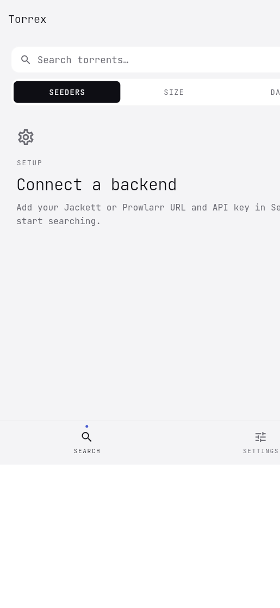
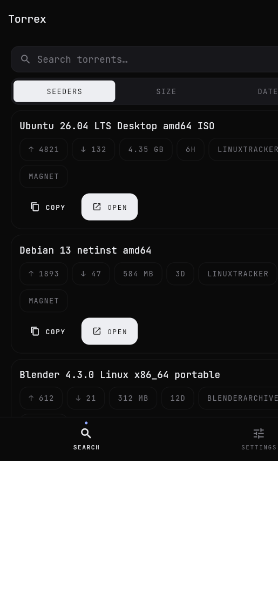
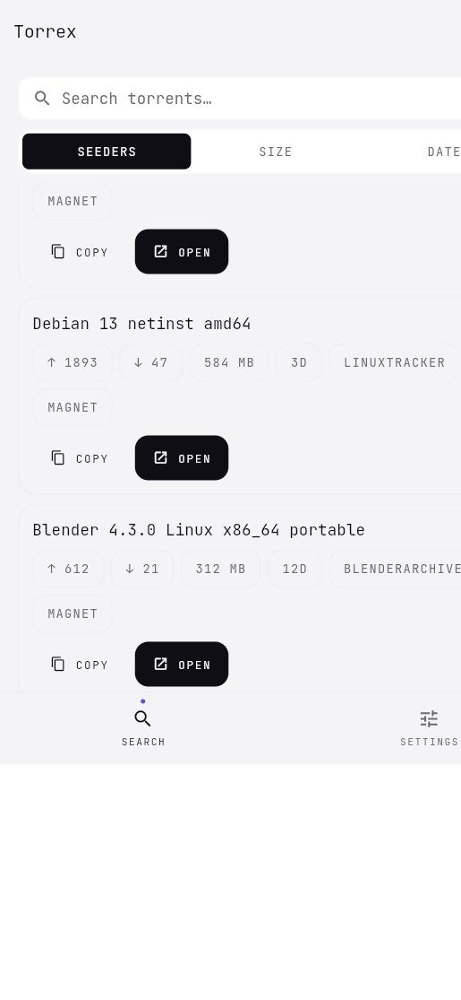
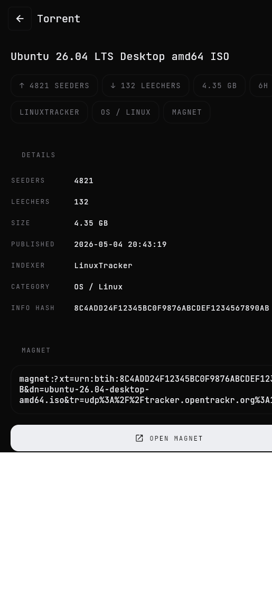
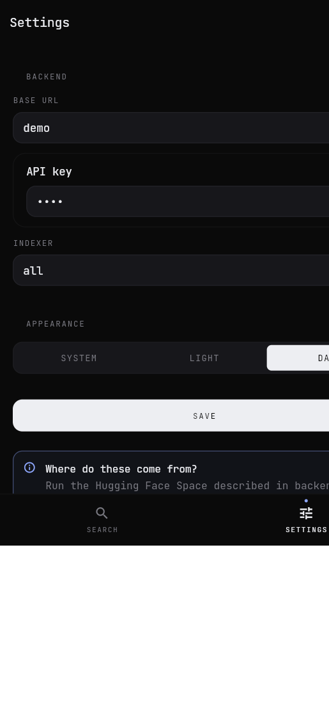

# Torrex · screenshot gallery

Captured against the live web build at a 412×892 mobile viewport
(`flutter build web --release` → `python -m http.server 8765`). Reproducible
from `main` — every screen is reachable via URL params:

| URL | Screen |
|-----|--------|
| `/?theme=light` | Search · empty (no backend configured) |
| `/?theme=dark&demo=1` | Search · results (built-in demo data) |
| `/?theme=light&demo=1` | Search · results · light |
| `/?theme=dark&demo=1&page=detail` | Detail page |
| `/?theme=dark&page=settings` | Settings |

> The `demo=1` query param activates an in-app sample dataset so the design
> system is visible without standing up a real Jackett/Prowlarr backend. It
> never makes a network call.

## Search

| Empty (light) | Results (dark) | Results (light) |
|---|---|---|
|  |  |  |

## Detail

| Detail (dark) |
|---|
|  |

The detail page mirrors what a typical torrent site shows on a "view"
page — full title, swarm stats, file size, indexer, publish date, info hash,
selectable raw magnet, plus four actions:

1. **Open magnet** → Android system chooser → installed torrent client
2. **Download .torrent** → indexer-hosted blob
3. **Copy link** → clipboard
4. **View on indexer** → original page in browser

## Settings

| Settings (dark) |
|---|
|  |

Three fields are persisted: backend base URL, API key (Keystore /
Keychain), and default indexer slug. Theme toggle is a simple
`WlmSegmentedControl` over `ThemeMode`.
