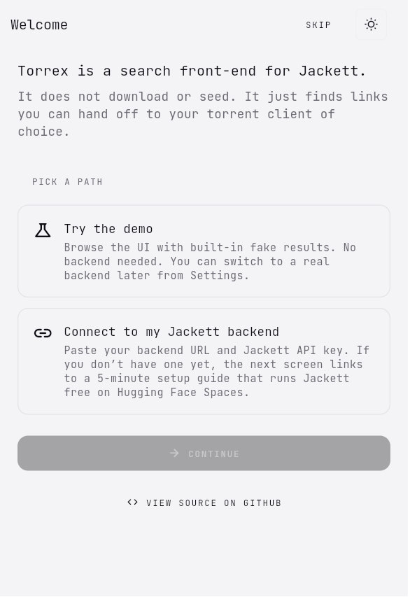
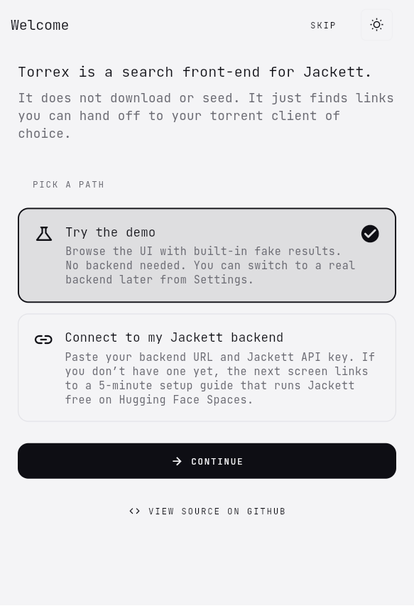
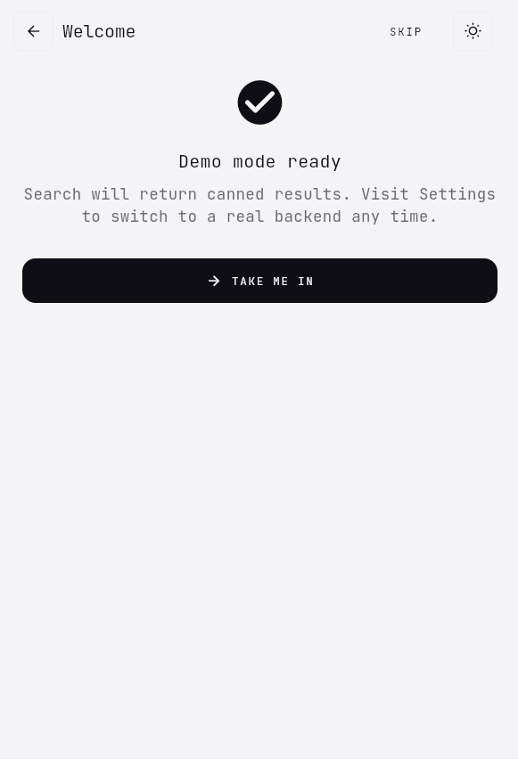
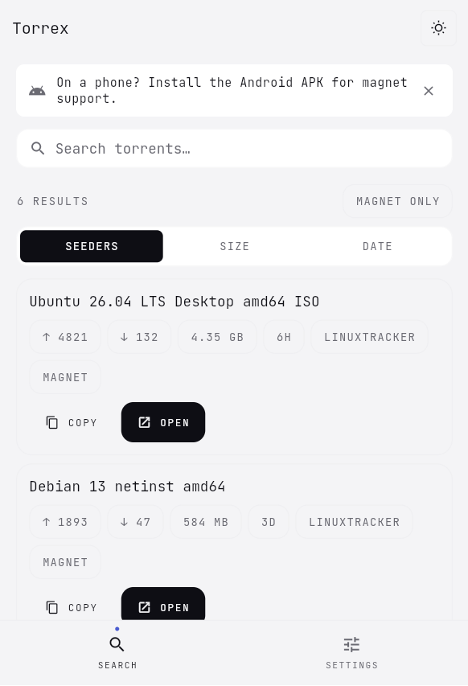
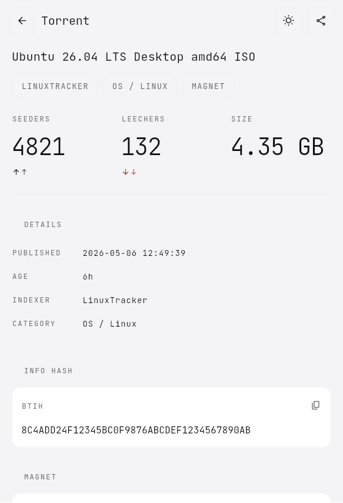
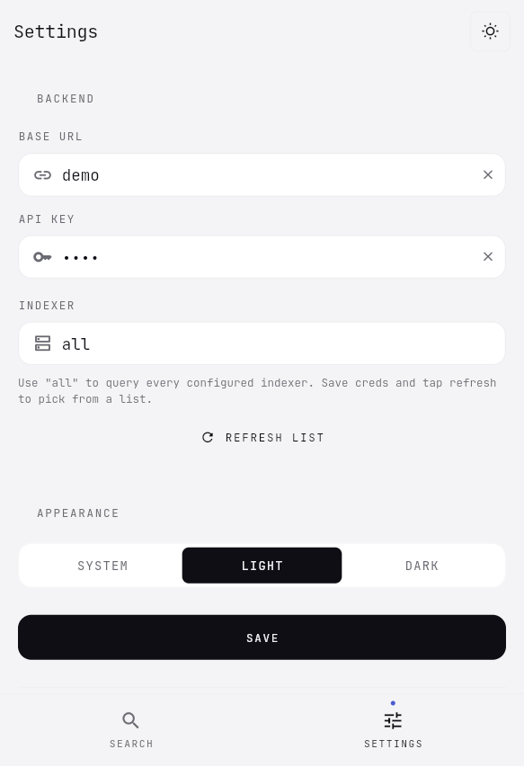
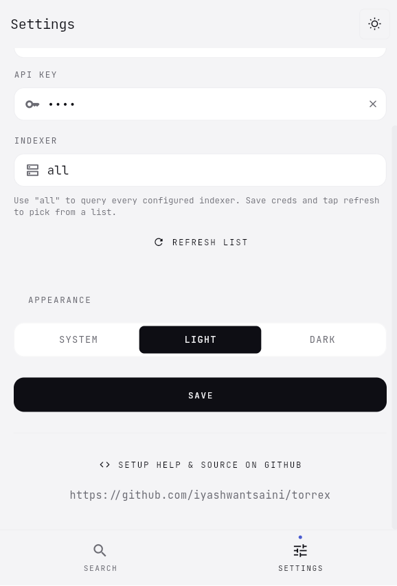

# Torrex · screenshot gallery

All shots captured from the live release web build (`flutter build web --release`)
served over `python -m http.server 8765`, against a portrait viewport of
**511 × 682 logical px** (= 639 × 853 physical at DPR 1.25). Every
screenshot in this gallery uses the same dimensions for visual
consistency.

Reproducible from `main` — every screen is reachable via URL params:

| URL | Screen |
|-----|--------|
| `/?theme=light` | Search · empty (no backend configured) |
| `/?theme=dark&demo=1` | Search · results (built-in demo data) |
| `/?theme=light&demo=1` | Search · results · light |
| `/?theme=dark&demo=1&page=detail` | Detail page |
| `/?theme=dark&page=settings` | Settings |

> The `demo=1` query param activates a small in-app sample dataset so the
> design system is visible without standing up a real Jackett/Prowlarr
> backend. It never makes a network call.
>
> The **theme toggle in the top-right of every screen** (Search, Settings,
> Onboarding, Detail) cycles system → light → dark → system. As of
> `0.2.0` the same widget renders identically on every screen — there's
> always one tap to flip themes.

## Onboarding (first launch)

New in `0.2.0`. The wizard guides users through picking a path
(demo / connect existing) and entering creds. Skippable at every
step (top-right `SKIP` button), never re-shown after `ui.onboardingDone`
is set. The theme toggle sits next to `SKIP`.

| Welcome / pick a path | Demo selected | Done |
|---|---|---|
|  |  |  |

## Search

| Demo data (current build) | Empty (light) | Results (dark) | Results (light) |
|---|---|---|---|
|  |  |  |  |

The home screen starts as a single search field — no clutter. **Filters
and sort only appear after the first search** (`SEEDERS / SIZE / DATE`
segmented control, `MAGNET ONLY` toggle chip, results count, and
client-side pagination of 10 per page based on the filter, not on the
indexer's page).

A compact one-line "On a phone? Install the Android APK" hint shows on
mobile-web only (width < 600 px) on the Search tab, and is dismissible.

## Detail

| Detail (light · current build) | Detail (dark) |
|---|---|
|  |  |

The detail page uses three [`WlmStat`](../app/lib/features/detail/detail_page.dart)
big-number tiles for the swarm stats, a spec-row block for metadata, and
two `WlmCodeBlock`s for the info hash and full magnet URI (horizontally
scrollable so they never overflow). The top-right has the theme toggle
followed by a share icon. Below the visible portion sit the actions:

1. **Open magnet** → Android system chooser → installed torrent client
2. **Download .torrent** → indexer-hosted file (web uses a proper
   `<a download>` anchor so the file lands in Downloads instead of
   navigating the SPA away). Hidden when the indexer didn't provide a
   `.torrent` URL — most public trackers (TPB, RARBG, Nyaa) only ship
   magnets, so showing a permanently-disabled button was just noise.
3. **Copy link** → clipboard
4. **Indexer page** → original page in browser

On viewport widths ≥ 900 px the search list and detail view render
side-by-side in a two-pane layout; tapping a result updates the right
pane instead of pushing a new route.

## Settings

| Settings (current build) | Bottom · GitHub link | Settings (dark) |
|---|---|---|
|  |  |  |

Three uniformly-styled `WlmTextField`s with leading icons (URL, key,
indexer), the API key obscured + clearable, and a `WlmSegmentedControl`
for theme. Persisted via `shared_preferences` + `flutter_secure_storage`
(API key never touches plain prefs).

When both creds are set and Jackett is reachable, the **Indexer**
field becomes a `WlmDropdown` populated from
`/api/v2.0/indexers?configured=true` with an "All indexers" default.
Falls back to a free-text field when the fetch fails.

The bottom of the page links to the project source on GitHub instead
of duplicating long-form setup docs in-app.

